# UTS-PBO


### Tujuan

Repo ini ditujukan untuk UTS Pemrograman Berbasis Object dengan studi kasus hewan

### Class Diagram

#### Graph :  



#### Attribute & Method :

>__Hewan__ :   

Attribut :
```java
    protected String nama;
    protected String warna;
    protected String habitat;
    protected int masaHidup;
    protected String caraBerkembangBiak;
    protected String makanan;
```
Method :
```java
```


>__HewanDarat__ :  

Attribut :
```java
    protected int jumlahKaki;
```
Method :
```java
```

>__HewanLaut__ :   

Attribut :
```java
```
Method :
```java
```

>__Burung__ :   

Attribut :
```java
    private int panjangSayap;
```
Method :
```java
```

>__Ikan__ :   

Attribut :
```java
    private int panjangSirip;
```
Method :
```java
```
